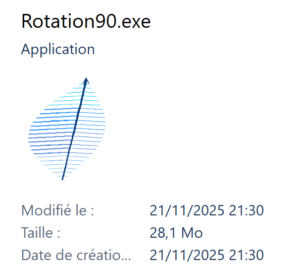
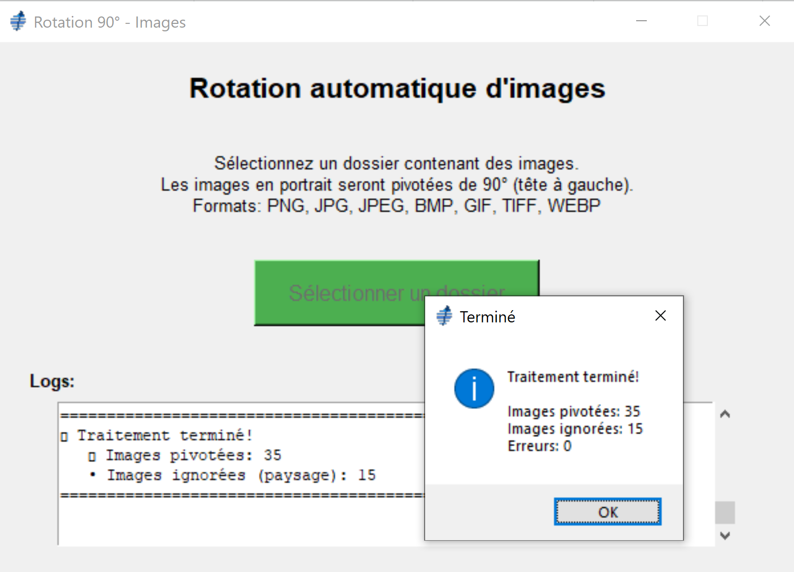

# 🪶 Rotation90

<div align="center">

**Outil automatique de rotation d'images portrait vers paysage**

[](https://www.python.org/downloads/)
[](https://www.microsoft.com/windows)



</div>

---

## Description

**Rotation90** est un logiciel simple et efficace qui détecte et pivote automatiquement les images en format portrait vers le format paysage. Parfait pour traiter rapidement des lots d'images sans manipulation manuelle.

### Caractéristiques principales

-  **Détection automatique** des images en portrait (hauteur > largeur)
-  **Rotation de 90°** dans le sens antihoraire (tête à gauche, format paysage)
-  **Support multi-formats** : PNG, JPG, JPEG, BMP, GIF, TIFF, WEBP
-  **Préservation intelligente** des images déjà en paysage
-  **Interface graphique** simple et intuitive
-  **Logs détaillés** du traitement en temps réel
-  **Conservation du format** d'origine après rotation

---

##  Installation

### Option 1 : Exécutable Windows (Recommandé)

**Pour les utilisateurs sans Python :**

1. Créez l'exécutable avec :
   ```bash
   python build_exe.py
   ```

2. Récupérez `Rotation90.exe` dans le dossier `dist/`

3. Double-cliquez et utilisez ! 

>  **Aucune installation** ni dépendance nécessaire

### Option 2 : Exécution avec Python

**Pour les développeurs :**

1. **Cloner le projet**
   ```bash
   git clone https://github.com/votre-username/rotation90.git
   cd rotation90
   ```

2. **Installer les dépendances**
   ```bash
   pip install -r requirements.txt
   ```

3. **Lancer l'application**
   ```bash
   python rotation90.py
   ```

---

## Utilisation

### Mode d'emploi

1. **Lancez** l'application (`Rotation90.exe` ou `python rotation90.py`)
2. **Cliquez** sur le bouton "Sélectionner un dossier"
3. **Choisissez** le dossier contenant vos images
4. **Attendez** le traitement automatique
5. **Consultez** le résumé des opérations

### Aperçu visuel

<div align="center">



*Interface simple et intuitive avec logs en temps réel*

</div>

### Exemple de transformation

| Avant | Après |
|-------|-------|
|  Portrait 800×1200 | Paysage 1200×800 (pivotée 90°) |
|  Paysage 1200×800 | Paysage 1200×800 (inchangée) |

>  **Important** : Les images originales sont modifiées. Faites une sauvegarde si nécessaire.

---

##  Technologies

- **Python 3.7+**
- **Pillow** (PIL) - Manipulation d'images
- **Tkinter** - Interface graphique
- **PyInstaller** - Création d'exécutables

---

##  Structure du projet

```
rotation90/
├── rotation90.py          # Application principale
├── build_exe.py          # Script de génération exe
├── create_icon.py        # Générateur d'icône
├── feather.ico           # Icône de l'application
├── feather.png           # Icône PNG
├── requirements.txt      # Dépendances Python
├── screenshots/          # Captures d'écran
│   ├── app_screenshot.png
│   └── interface.png
└── README.md            # Documentation
```

---

##  Build de l'exécutable

Pour créer votre propre exécutable Windows :

```bash
# Installer les dépendances
pip install -r requirements.txt

# Générer l'exécutable
python build_exe.py

# L'exe sera dans dist/Rotation90.exe
```

**Configuration PyInstaller :**
- Mode `--onefile` (fichier unique)
- Mode `--windowed` (sans console)
- Icône personnalisée incluse
- Toutes les dépendances embarquées

---

##  Contribution

Les contributions sont les bienvenues ! N'hésitez pas à :

-  Signaler des bugs
-  Proposer des nouvelles fonctionnalités
-  Soumettre des pull requests

---

## License

Ce projet est libre et open source.

---

<div align="center">

** N'oubliez pas de mettre une étoile si ce projet vous aide ! **

</div>
